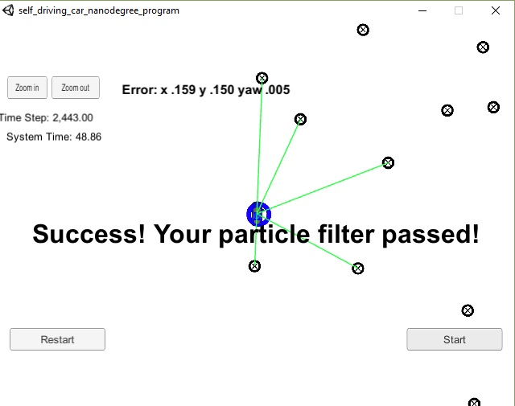

# A particle filter for localization
In this repo, we provide a simple particle filter capable of localizing a car in 2D space. Specifically, in this repository, you will see how to:

1. Initialize a particle filter from a rough initial guess of the car's position and orientation. 
2. Update the particle's position and orientation when new velocity and angular rate measurement are obtained. 
3. Update the weights of the particles in response to a given set of landmark measurements. 
4. Resample particles once the weights are updated. 

## Initialization 

A particle filter maintains a collection of particles, where each particle represents a hypothetical state of the system. For instance, in the localization task we want to use a particle filter to estimate the $xy$ position and orientation $\theta$ of a car. Each of these hypothetical particles has a weight attached to it, where the weight is proportional to the likelihood that the particle is the actual state of the system. Therefore to initialize the particle filter, we need to 

1. Choose how many particles we will be using.
2. Randomly generate the chosen number of particles.
3. Specify our belief about how likely each of these particles is. 

In our code, we assume that you have some sensor (e.g. GPS) which is capable of producing a rough measurement of the system's state ($x$, $y$, $\theta$), where the sensor has additive Gaussian noise with known covariance. Actually, in our example we assume that the measurements of $x$, $y$, and $\theta$ are mutually independent so that the covariance matrix is diagonal and equal to 
$$
\left[\begin{array}{ccc}
\sigma_y & 0 & 0 \\
0 & \sigma_x & 0 \\
 0 & 0 &\sigma_\theta
\end{array}\right]
$$
Hence to generate our particles, we can use the following pseudocode:

```python
def initializeParticles( x, y, theta, std_x, std_y, std_theta ):
    n_particles = 10
    particles = allocateParticles( n_particles ) 
    for i in [ 1, ..., n_particles ]
        particles[i].x     = gaussian(     x,     std_x )
        particles[i].y     = gaussian(     y,     std_y )
        particles[i].theta = gaussian( theta, std_theta )
    return particles
```

Furthermore, as we said, we want to initialize the weights to represent our belief in how likely the particles are. This is quite simple because in the above code, we have already implicitly made a statement about the initial probability distribution... We have said that it is Gaussian, and that we know its covariance. Hence the likelihood (and therefore weight) of each particle $p$ is given by
$$
p_{weight} =
\dfrac{\exp\left(-\dfrac{1}{2}\left[\dfrac{x - p_x}{\sigma_x}\right]^2\right)}{ \sigma_x\sqrt{2\pi} }
\dfrac{\exp\left(-\dfrac{1}{2}\left[\dfrac{y - p_y}{\sigma_y}\right]^2\right)}{ \sigma_y\sqrt{2\pi} }
\dfrac{\exp\left(-\dfrac{1}{2}\left[\dfrac{\theta -p_\theta}{\sigma_\theta}\right]^2\right)}{ \sigma_\theta\sqrt{2\pi} }
$$

## Prediction 

In the first iteration, we need to initialize the filter as we described in the previous section. However, in subsequent iterations, we simply want to predict the position and orientation of each particle by using a motion model. You should choose the motion model that best fits your assumptions about the underlying dynamics of your system, but in our case, we use the "constant velocity and yaw rate" model. According to this model, the position and orientation of each particle are updated according to
$$
\begin{align}
p_x & \texttt{ += } \dfrac{v}{\dot{\theta}}  \Big(+\sin(p_\theta + h \dot{\theta}) - \sin(p_\theta)\Big) \\
p_y & \texttt{ += } \dfrac{v}{\dot{\theta}} \Big(-\cos(p_\theta + h \dot{\theta}) + \cos(p_\theta)\Big) \\
p_\theta & \texttt{ += } h \dot{\theta}
\end{align}
$$
where $v$ denotes the velocity of the car, $\dot{\theta}$ denotes the yaw rate, and $h$ denotes the elapsed time since the previous measurement. Note that to use this prediction, you would either have to 

1. Set up a filter to predict the rates $v$ and $\dot{\theta}$
2. Have a sensor (like radar) that measures these values
3. Combine the previous approaches

Doing so is beyond the scope of this project, so we simply assume that this data ($v$ and $\dot{\theta}$) is somehow provided. 

## Weight updates

To update the weights of the particles, we need some way of updating our belief about whether a particle is likely or unlikely. That process almost always looks like:

1. Obtain a measurement of the current position.
2. Predict what the measurement should be if there was no noise, and the particle was 100% accurate.
3. Update the likelihood (weight) of the particle according to how close the measurement is to the prediction. 

Thus in principle, we can update the weights whenever we get a measurement that gives us some information about either the position or orientation of the car (or one of its derivatives). In previous projects, we used extended and unscented Kalman filters to accomplish this with measurements of the positions, velocities, and angular rates. Therefore we aren't going to rehash that information other than to say that those filters could be viewed as special cases of a particle filter, with a particular way of updating weights based on the assumptions made therein.  In this project, we are focusing on how to accomplish localization when we are given a landmark map, and measurements of some landmarks in it.  

First, before we proceed, let's overview the situation we want to consider...

1. We assume that we are given a map of landmarks with $xy$ coordinates of those landmarks in some absolute coordinate system. We subsequently call these "*map coordinates*". 
2. We obtain measurements of the position of the car relative to *some* landmarks in car-coordinates. However we don't know which specific landmarks the measurements correspond to. For instance, if the map has trees in it, all the map will say is something like, ''We sensed ***a*** tree at (x,y)=(5m,10m)''.
3. We want to determine the position and orientation of the car in map coordinates. 


To accomplish this, we propose a number of hypothetical particles (with positions and orientations) in the map coordinate system, where each particle has a weight proportional to the likelihood that the landmark measurements came from that particle. Specifically, when we get new landmark measurements, we can update the particle weights using the following pseudocode:

```
def updateWeights( landmarks, landmark_measurements ):
	
	for particle in particles:
    
        /* Convert the landmark measurements to map coordinates assuming 
           that the current particle represents the true state of the car. */
        transformed_landmarks = transformToMapCoordinates( landmark_measurements, particle )
        
        /* For each landmark observation, find the nearest landmark in the map. */
        i = 0
        for landmark in landmark_measurements:
            closest_landmarks[i] = nearestLandmark( landmark, landmarks )
            ++i

		/* Now, evaluate the likelihood that the current particle represents the true 
		   state of the system by computing how likely it would be for the landmark 
		   measurements to have come from this particle */
         particle.weight = 1
		for i = 1, ..., n_landmark_measurements:
		    particle.weight *= likelihood( transformed_landmarks[i], closest_landmarks[i], measurement_std )
         
```

## Resampling

Finally, once we have updated the particles' weights, we will generate a new set of particles by sampling from the previous set of particles (with replacement). Specifically, we generate a new set of samples by:

1. Normalizing the weights so that they sum to 1.
2. Sampling from the previous set of particles under the assumption that each particle has a probability equal to its normalized weight.  

We carry out step 2 until we have the desired number of samples. 

## Quick Start
The code in this project was designed to be used with [this simulator](https://github.com/udacity/self-driving-car-sim/releases). To prepare your system, run the `install-xxx.sh` script appropriate for your system. Then, as necessary, you can run the commands

1. `mkdir build`
2. `cd build`
3. `cmake ..`
4. `make`
5. `./particle_filter`

After Step 5, you can start `Project 3` from the simulator. If everything was successful, then after about 50 seconds, the simulator should display the following output:

